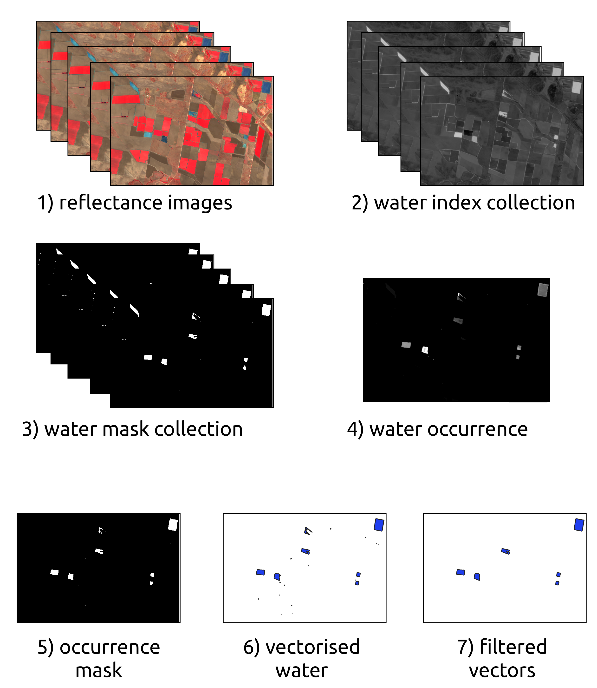
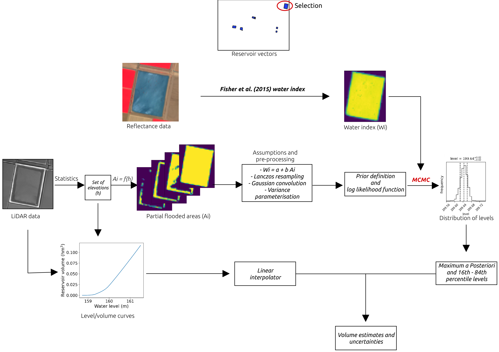
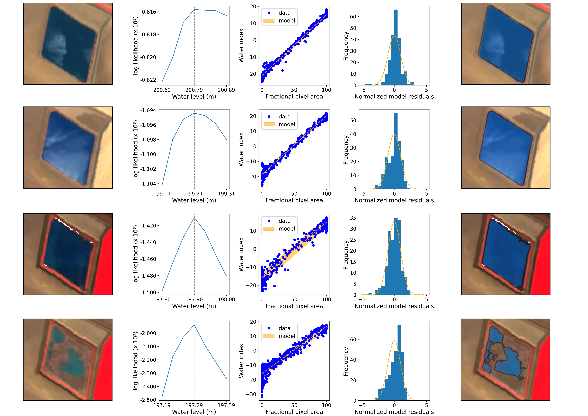

# Reservoir_EMS

Code associated with Environmental Modelling & Softwate manuscript entitled [*Volume and uncertainty estimates of on-farm reservoirs using surface reflectance and LiDAR data*](https://www.sciencedirect.com/science/article/pii/S1364815221001389) by Ignacio Fuentes, Richard Scalzo, and R. Willem Vervoort from The University of Sydney.

**doi**: https://doi.org/10.1016/j.envsoft.2021.105095

## About

It consists of two main google colaboratory files where, based on a water index defined in Fisher et al. (2015):

* The detection of on-farms reservoirs is carried out through the calculation of water occurrences from Sentinel 2 images.
<p align="center">
  
</p>

* Volumes are modelled using Bayesian inference and combining LiDAR data and Sentinel 2 surface reflectance images.
<p align="center">
  
</p>

This methodology allows monitoring agricultural reservoir volumes in time:

<p align="center">
  
</p>

It requires emcee==3.0.2.

## How to cite this work?

### Article

```
@article{fuentes2021volume,
  title={Volume and uncertainty estimates of on-farm reservoirs using surface reflectance and LiDAR data},
  author={Fuentes, Ignacio and Scalzo, Richard and Vervoort, R Willem},
  journal={Environmental Modelling \& Software},
  pages={105095},
  year={2021},
  publisher={Elsevier}
}
```
